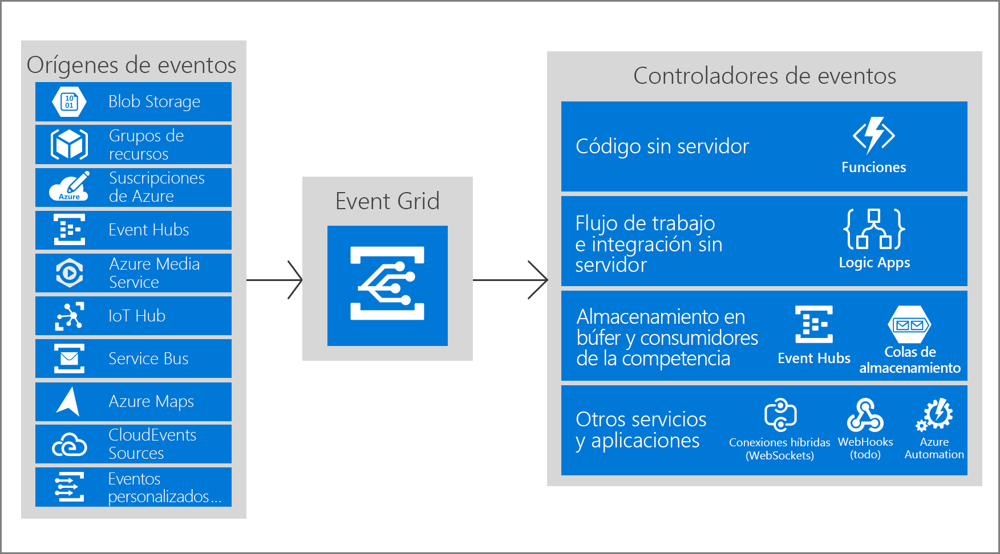
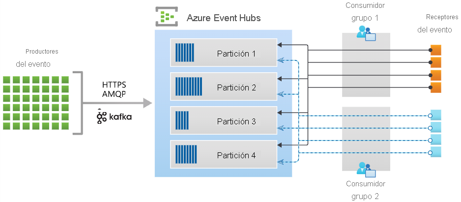
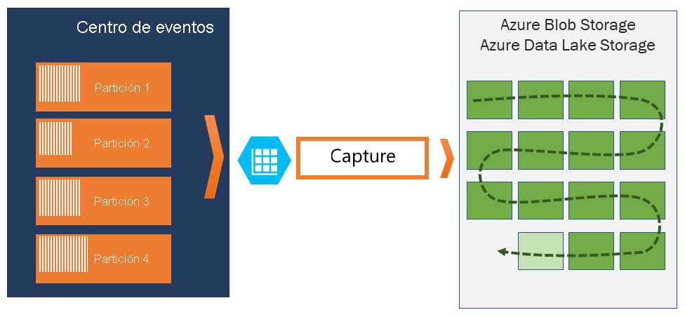

# **Microsoft Certified: Azure Developer Associate - Desarrollo de soluciones basadas en eventos**
## **Temario**
- [**Microsoft Certified: Azure Developer Associate - Desarrollo de soluciones basadas en eventos**](#microsoft-certified-azure-developer-associate---desarrollo-de-soluciones-basadas-en-eventos)
  - [**Temario**](#temario)
  - [**Exploración de Azure Event Grid**](#exploración-de-azure-event-grid)
    - [**Conceptos de Azure Event Grid**](#conceptos-de-azure-event-grid)
      - [**Eventos**](#eventos)
    - [**Detección de esquemas de eventos**](#detección-de-esquemas-de-eventos)
    - [**Esquema de CloudEvents V1.0**](#esquema-de-cloudevents-v10)
    - [**Exploración de la durabilidad de la entrega de eventos**](#exploración-de-la-durabilidad-de-la-entrega-de-eventos)
    - [**Directiva de reintentos**](#directiva-de-reintentos)
    - [**Procesamiento por lotes de salida**](#procesamiento-por-lotes-de-salida)
    - [**Entrega retrasada**](#entrega-retrasada)
    - [**Eventos fallidos**](#eventos-fallidos)
    - [**Control de acceso a eventos**](#control-de-acceso-a-eventos)
    - [**Recepción de eventos mediante webhooks**](#recepción-de-eventos-mediante-webhooks)
    - [**Filtrado de eventos**](#filtrado-de-eventos)
  - [**Exploración de Azure Event Hubs**](#exploración-de-azure-event-hubs)
    - [**Conceptos clave**](#conceptos-clave)
    - [**Event Hubs Capture**](#event-hubs-capture)
      - [**Cómo funciona Event Hubs Capture**](#cómo-funciona-event-hubs-capture)
      - [**Ventanas de captura**](#ventanas-de-captura)
      - [**Escalado a unidades de procesamiento**](#escalado-a-unidades-de-procesamiento)
    - [**Escalado de la aplicación de procesamiento**](#escalado-de-la-aplicación-de-procesamiento)
    - [**Control del acceso a eventos**](#control-del-acceso-a-eventos)

## **Exploración de Azure Event Grid**
- Backplane de eventos que permite programación reactiva y basada en eventos.
- Modelo publicación-suscripción
- Publicador: emite eventos (pero no sabe como se administran)
- Suscriptor: deciden que eventos administrar

Event Grid permite compilar aplicaciones con arquitecturas basadas en eventos fácilmente.



### **Conceptos de Azure Event Grid**
- Eventos
- Orígenes de eventos
- Temas: Punto de conexión donde los publicadores envían los eventos
- Suscripciones a eventos: Mecanismo integrado para enrutar eventos, a veces a más de un controlador de eventos
- Controladores de eventos: Aplicación o servicio que reacciona al evento

#### **Eventos**
- Origen
- Hora producido
- Identificador único
- Información relevante en su tipo.

### **Detección de esquemas de eventos**
- Evento consta de un conjunto de cuatro propiedades de cadena.
- Un evento es enviado en una matriz que puede tener un tamaño total de hasta 1 MB
- Event Grid envía los eventos en una matriz que tiene un solo evento.

**Esquema del evento**
```json
[
  {
    "topic": string,
    "subject": string,
    "id": string,
    "eventType": string,
    "eventTime": string,
    "data":{
      object-unique-to-each-publisher
    },
    "dataVersion": string,
    "metadataVersion": string
  }
]
```

### **Esquema de CloudEvents V1.0**
- Event Grid también admite eventos de implementación JSON de CloudEvents v1.0 y el enlace de protocolo HTTP.
- CloudEvents simplifica interoperabilidad

Ejemplo Azure Blob Storage en formato de Cloud Events:
```json
{
    "specversion": "1.0",
    "type": "Microsoft.Storage.BlobCreated",  
    "source": "/subscriptions/{subscription-id}/resourceGroups/{resource-group}/providers/Microsoft.Storage/storageAccounts/{storage-account}",
    "id": "9aeb0fdf-c01e-0131-0922-9eb54906e209",
    "time": "2019-11-18T15:13:39.4589254Z",
    "subject": "blobServices/default/containers/{storage-container}/blobs/{new-file}",
    "dataschema": "#",
    "data": {
        "api": "PutBlockList",
        "clientRequestId": "4c5dd7fb-2c48-4a27-bb30-5361b5de920a",
        "requestId": "9aeb0fdf-c01e-0131-0922-9eb549000000",
        "eTag": "0x8D76C39E4407333",
        "contentType": "image/png",
        "contentLength": 30699,
        "blobType": "BlockBlob",
        "url": "https://gridtesting.blob.core.windows.net/testcontainer/{new-file}",
        "sequencer": "000000000000000000000000000099240000000000c41c18",
        "storageDiagnostics": {
            "batchId": "681fe319-3006-00a8-0022-9e7cde000000"
        }
    }
}
```

### **Exploración de la durabilidad de la entrega de eventos**
- Event Grid intenta entregar cada evento almenos una vez
- Reintenta según una programación de reintentos fijo y una directiva de reintentos
- Predeterminado: Event Grid entrega un evento cada vez y la carga útil: una matriz(en json) con un único evento

### **Directiva de reintentos**
- Número máximo de intentos
- Período de vida del evento

### **Procesamiento por lotes de salida**
- Procesar por lotes los eventos
- Se encuentra descativado, y se activa por suscripción mediante Portal,CLI,etc.
- Opciones que brinda la entrega por lotes:
  - Número máximo de eventos por lote:
  - Tamaño de lote preferido en KB:

> El tamaño del lote esta por debajo en prioridad al número máximo

### **Entrega retrasada**
- Si un punto de conexión experimenta errores de entrega, Event Grid retrasa la entraga y reintenta enviar.

### **Eventos fallidos**
- Si no se pudo entregar en un tiempo o cantidad de veces
- Se envia a una cuenta de almacenamiento
- Este acto se conoce como **"colas de mensajes fallidos"**.
- Opción deshabilitada.
- Si la ubicación de la cola de mensajes fallidos no está disponible durante cuatro horas, se elimina el evento.

### **Control de acceso a eventos**
Roles:
- Lector de la suscripción de Event Grid
- Colaborador de la suscripción de Event Grid
- Colaborador de Event Grid
- Remitente de datos de Event Grid

### **Recepción de eventos mediante webhooks**
Mayor información: https://docs.microsoft.com/es-es/training/modules/azure-event-grid/6-webhook-event-delivery

### **Filtrado de eventos**
- Por tipos de eventos
- El asunto empieza o termina con
- Operadores y campos avanzados

Mayor información: https://docs.microsoft.com/es-es/training/modules/azure-event-grid/7-event-grid-filtering

## **Exploración de Azure Event Hubs**
- Plataforma de streaming de macrodatos
- Servicio de ingesta de eventos
- Se encuentra entre publicadores de eventos y consumidores de eventos
- Ofrece unificación y búfer de retención de tiempo

### **Conceptos clave**
- Cliente de centros de eventos: Interfaz
- Productor de centros de eventos: Cliente como órigen de datos
- Consumidor de centros de eventos: Cliente que lee información
- Partición: Secuencia ordenada de eventos mantenida en el centro de eventos
- Grupo de consumidores: Vista de un centro de eventos completo
- Receptores de eventos: Entidad que lee datos
- Unidades de rendimiento o Unidades de procesamiento: Compradas que controlan capacidad de rendimiento de Event Hubs



### **Event Hubs Capture**
- Captura los datos de streaming de Event Hubs de la cuenta de Blob Storage o Data Lake Storage que prefiera.
- Especificar un intervalo de tiempo o de tamaño



#### **Cómo funciona Event Hubs Capture**
- Búfer duradero de retención temporal
- Consumidor con particiones
- Partición: Segmento de datos independiente
- Especificar su propia cuenta y contenedor de Azure Blob Storage, Azure Data Lake Storage donde se almacenan datos capturados.
- Escritos en Apache Avro

#### **Ventanas de captura**
- Controla la captura
- Es una configuración mínima de tamaño y tiempo
- "Directiva de el primero gana"
- Primer desencadenador provocará una operación de captura
- Cada partición se captura de forma independiente.

#### **Escalado a unidades de procesamiento**
- El tráfico lo controlan las unidades de procesamiento
- 1 Unidad = 1 MB/s o 1000 eventos por segundo y una salida que duplica esas cifras.

### **Escalado de la aplicación de procesamiento**
Mayor información: https://docs.microsoft.com/es-es/training/modules/azure-event-hubs/4-event-processing

### **Control del acceso a eventos**
- Event Hubs admite Azure AD y firmas de acceso comaprtido (SAS): Autorización y Autenticación
- Roles:
  - Propietario de datos: acceso total a recursos de Event Hubs
  - Remitente de datos: acceso de envio
  - Destinatario de datos: acceso de recepción

Existe casos:
- **Autorización del acceso con identidades administradas**
- **Autorización del acceso con la Plataforma de identidad de Microsoft**
- **Autorización del acceso a publicadores de Event Hubs con firmas de acceso compartido**
- **Autorización del acceso a consumidores de Event Hubs con firmas de acceso compartido**

Mayor información: https://docs.microsoft.com/es-es/training/modules/azure-event-hubs/5-event-hubs-authentication-authorization