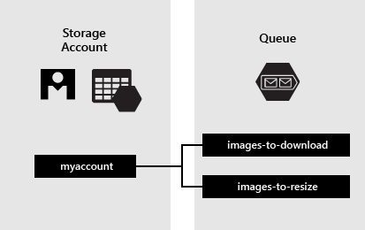

# **Microsoft Certified: Azure Developer Associate - Desarrollo de soluciones basadas en mensajes**
## **Temario**
- [**Microsoft Certified: Azure Developer Associate - Desarrollo de soluciones basadas en mensajes**](#microsoft-certified-azure-developer-associate---desarrollo-de-soluciones-basadas-en-mensajes)
  - [**Temario**](#temario)
  - [**Colas de mensajes de Azure**](#colas-de-mensajes-de-azure)
  - [**Elección de una solución de cola de mensajes**](#elección-de-una-solución-de-cola-de-mensajes)
    - [**Consideración del uso de colas de Service Bus**](#consideración-del-uso-de-colas-de-service-bus)
    - [**Consideración del uso de colas de Storage**](#consideración-del-uso-de-colas-de-storage)
  - [**Análisis de Azure Service Bus**](#análisis-de-azure-service-bus)
    - [**Colas, temas y suscripciones de Service Bus**](#colas-temas-y-suscripciones-de-service-bus)
      - [**Colas**](#colas)
      - [**Modelos de recepción**](#modelos-de-recepción)
      - [**Temas y suscripciones**](#temas-y-suscripciones)
      - [**Cargas de mensajes y serialización en Service Bus**](#cargas-de-mensajes-y-serialización-en-service-bus)
      - [**Enrutamiento y correlación de mensajes**](#enrutamiento-y-correlación-de-mensajes)
      - [**Serialización de carga**](#serialización-de-carga)
  - [**Análisis de Azure Queue Storage**](#análisis-de-azure-queue-storage)

## **Colas de mensajes de Azure**
- Colas de Service Bus: Parte de una infraestructura de mensajería que admite puesta en cola, publicación o suscripción, patrones de integración avanzados. Diseñada para integrar y abarcan varios protocolos de comunicación, contratos de datos, dominios de confianza o entornos de red.
- Colas de Storage: Parte de Azure Storage. Almacenar gran número de mensajes, que se pueden acceder mediante HTTP/S. Mensaje de hasta 64KB.

## **Elección de una solución de cola de mensajes**
### **Consideración del uso de colas de Service Bus**
- Recibir mensajes sin sondear la cola
- Entrega ordenada por primero en entrar, primero en salir (FIFO)
- Detección automática de duplicados
- Comportamiento transaccional y atomicidad
- Superar los 64KB pero no los 256KB
### **Consideración del uso de colas de Storage**
- Más de 80GB de mensajes en cola
- Seguimiento del progreso del procesamiento de un mensaje de la cola, o continuar el trabajo donde se dejó con la información
- Necesita registros de lado de servidor de todas las transacciones ejecutadas con las colas

## **Análisis de Azure Service Bus**
- Desacopla aplicaciones y servicios
- Usa mensajes: decorado con metadatos que contiene datos
- Mensaje en algun dato y un formato común: JSON, XML , Avro, TXT
- Escenarios:
  - Mensajería
  - Desacoplar aplicaciones
  - Temas y suscripciones
  - Sesiones de mensajes

- Niveles de Service Bus:
  - Prémium: Proceso evelado, rendimiento predecible, precio fijo, escalar carga de trabajo, mensajes de hasta 100 MB. Escenarios de Producción.
  - Estándar: Proceso variable, latencia variable, pago por uso, mensaje de hasta 256 KB, no escala.

- **Características avanzadas**
  - Sesiones de mensajes: Garantía de FIFO
  - Artículo reenvío automático: encola a otra cola o tema
  - Cola de mensajes fallidos
  - Entrega programada
  - Aplazamiento de mensajes
  - Procesamiento por lotes
  - Transacciones: operaciones de agrupación
  - Filtrado y acciones: mensajes filtrados de un tema
  - Eliminación automática en estado inactivo: cola
  - Detección de duplicados
  - Protocolos de seguridad: SAS, RBAC y Entidades administradas
  - Recuperación ante desastres geográfica
  - Seguridad: AMQP 1.0 y HTTP/REST

- Cumplimiento de estándares y protocolos:
  - Conexión principal es AMQP 1.0: estándar abierto de ISO/IEC
  - Compatible con API Java Message Service (JMS) 2.0

### **Colas, temas y suscripciones de Service Bus**
#### **Colas**
- Modelo FIFO
- Solo un destinatario proceso el mensaje.
- Nivelación de la carga entre productores y consumidores al externalizar la administración de mensajes
- Acoplamiento no estricto inherente entre componentes
#### **Modelos de recepción**
- Recibir y eliminar: mensaje marcado como consumido y se devuelve a la aplicación del consumidor
- Bloqueo de inspección: Recepción se convierte en 2 fases, no tolerando perdida de mensajes.
  - Bloque el mensaje para que otros consumidores lo reciban, y devuelve a la aplicación
  - Luego de procesado en la aplicación, esta solicita marcar el mensaje como consumido. Si no puede procesar mensaje, solicita que abandone el mensaje.
  - Tiempo de espera asociado al bloqueo. Desbloquea el mensaje
#### **Temas y suscripciones**
- Una cola permite que un ÚNICO consumidor procese un mensaje
- Temas y suscripciones proporcionan vía de 1 a varios en un patrón de publicación y suscripción.
- Un mensaje publicado se pone a disposición de todas las suscripciones.
- Los consumidores deben suscribirse al tema para recibir mensajes
- Una suscripción es una cola virtual en que recibe copias de los mensajes que se envían al tema.
- Crear tema es crear cola.

#### **Cargas de mensajes y serialización en Service Bus**
- Mensajes: carga y metadatos
- Metadatos: clave-valor
- Metadatos: describen la carga y ofrecen instrucciones de control 
- Propiedades de agente: definidas por el sistema
- Propiedades de usuario: colección clave-valor

#### **Enrutamiento y correlación de mensajes**
- `To`, `ReplyTo`, `ReplyToSessionId`, `MessageId`, `CorrelationId` y `SessionId` se usan para ayudar a aplicaciones a enrutar mensajes a destinos particulares.
- Patrones donde se usan:
  - Solicitud/respuesta simple: Publicador envia mensaje, espera respuesta. Tiene una cola donde espera la respuesta. La dirección de la cola se expresa en `ReplyTo` en el mensaje que envió Publicador.

Más información: https://docs.microsoft.com/es-es/training/modules/discover-azure-message-queue/5-messages-payloads-serialization

#### **Serialización de carga**
- La carga es un bloque opaco y binario
Más información: https://docs.microsoft.com/es-es/training/modules/discover-azure-message-queue/5-messages-payloads-serialization

## **Análisis de Azure Queue Storage**
- Almacena grandes cantidades de mensajes (HTTP/HTTPS)
- Mensaje de hasta 64KB
- Limite de capacidad de una cuenta de almacenamiento

