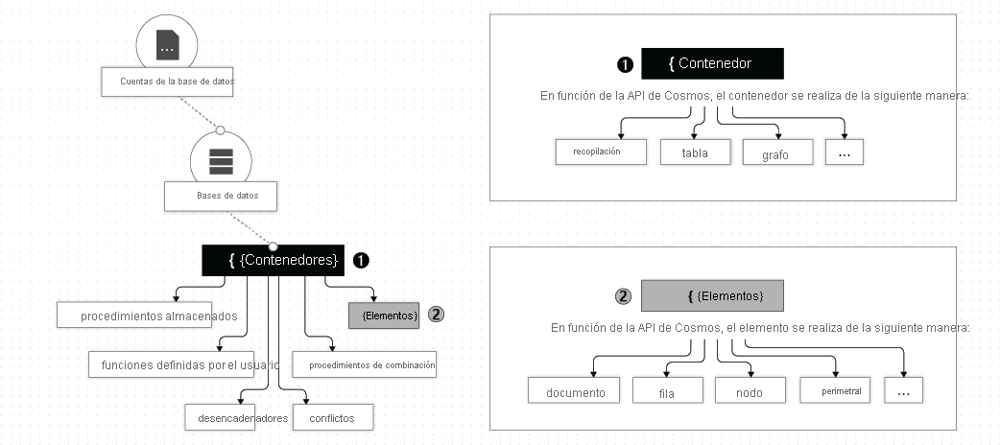
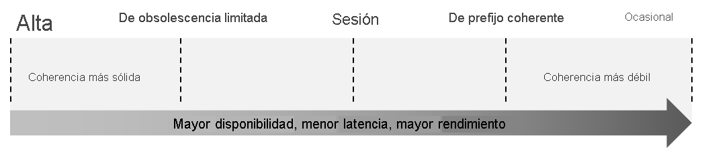
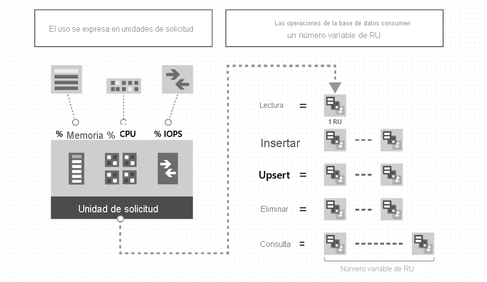

# **Microsoft Certified: Azure Developer Associate - Desarrollo de soluciones que usan Azure Cosmos DB**
## **Temario**
- [**Microsoft Certified: Azure Developer Associate - Desarrollo de soluciones que usan Azure Cosmos DB**](#microsoft-certified-azure-developer-associate---desarrollo-de-soluciones-que-usan-azure-cosmos-db)
  - [**Temario**](#temario)
  - [**Exploración de Azure Cosmos DB**](#exploración-de-azure-cosmos-db)
    - [**Ventajas clave de distribución global**](#ventajas-clave-de-distribución-global)
    - [**Exploración de la jerarquía de recursos**](#exploración-de-la-jerarquía-de-recursos)
      - [**Elementos de una cuenta de Azure Cosmos**](#elementos-de-una-cuenta-de-azure-cosmos)
        - [**Bases de datos de Azure Cosmos**](#bases-de-datos-de-azure-cosmos)
        - [**Contenedores de Azure Cosmos**](#contenedores-de-azure-cosmos)
    - [**Exploración de los niveles de coherencia**](#exploración-de-los-niveles-de-coherencia)
    - [**Selección del nivel de coherencia adecuado**](#selección-del-nivel-de-coherencia-adecuado)
      - [**SQL API y Table API**](#sql-api-y-table-api)
      - [**Cassandra, MongoDB y Gremlin API**](#cassandra-mongodb-y-gremlin-api)
      - [**Garantías de coherencia en la práctica**](#garantías-de-coherencia-en-la-práctica)
    - [**Exploración de las API admitidas**](#exploración-de-las-api-admitidas)
      - [**API CORE(SQL)**](#api-coresql)
      - [**API para MongoDB**](#api-para-mongodb)
      - [**Cassandra API**](#cassandra-api)
      - [**Table API**](#table-api)
      - [**API de Gremlin**](#api-de-gremlin)
    - [**Detección de las unidades de solicitud**](#detección-de-las-unidades-de-solicitud)
    - [**Exploración de particiones**](#exploración-de-particiones)
      - [**Particiones lógicas**](#particiones-lógicas)
      - [**Particiones físicas**](#particiones-físicas)
    - [**Clave de partición**](#clave-de-partición)
    - [**Creación de una clave de partición sintética**](#creación-de-una-clave-de-partición-sintética)
  - [**Trabajo con Azure Cosmos DB**](#trabajo-con-azure-cosmos-db)

## **Exploración de Azure Cosmos DB**
- Latencia baja
- Escalabilidad elástica del rendimiento
- Semántica definida para coherencia de datos
- Alta disponibilidad
- Bases de datos distribuidas de manera global

### **Ventajas clave de distribución global**
Todas las regiones admiten lecturas y escrituras gracias a la arquitectura multimaestro

### **Exploración de la jerarquía de recursos**
- Cuenta de Azure Cosmos: Unidad fundamental de distribución global y alta disponibilidad
- Brinda DNS único
- Puede agregar y quitar regiones de Azure en cualquier momento.

#### **Elementos de una cuenta de Azure Cosmos**
- Contenedor: Unidad fundamental de escalabilidad
- Rendimiento aprovisionado
- Almacenamiento ilimitado en un contenedor
- Realiza particiones en contenedor mediante clave de partición lógica
- Máximo de 50 cuentas de Azure Cosmos



##### **Bases de datos de Azure Cosmos**
- Varias bases de datos de Azure Cosmos en su CUENTA. 
- Una BD es análoga a un espacio de nombres
- Una BD es la unidad de administración de un conj. de contenedores de Azure Cosmos

##### **Contenedores de Azure Cosmos**
- Unidad de escalabilidad del rendimiento y del almacenamiento aprovisionados
- Se divide de forma horizontal y luego se replica en varias regiones
- Rendimiento en 2 modos:
    1. Rendimiento aprovisionado dedicado: 
    2. Rendimineto aprovisionado compartido:

Mayor información: https://docs.microsoft.com/es-es/learn/modules/explore-azure-cosmos-db/3-cosmos-db-resource-hierarchy

### **Exploración de los niveles de coherencia**
Cinco modelos de coherencia:
- Seguro(Alto o Fuerte)
- Obsolescencia limitada
- Sesión
- Prefijo coherente
- Posible(Ocasional)



### **Selección del nivel de coherencia adecuado**
Cada modelo de coherencia se usa para escenarios específicos.
#### **SQL API y Table API**
Varia entre "sesión","obsolescencia limitada", "prefijo coherente" y "posible coherencia". Puede crear un nivel de coherencia personalizado.
#### **Cassandra, MongoDB y Gremlin API**
Consulte [Asignación de coherencia de Cassandra API](https://docs.microsoft.com/es-es/azure/cosmos-db/cassandra/apache-cassandra-consistency-mapping) y [Asignación de coherencia de API para MongoDB.](https://docs.microsoft.com/es-es/azure/cosmos-db/mongodb/consistency-mapping).
#### **Garantías de coherencia en la práctica**

### **Exploración de las API admitidas**
#### **API CORE(SQL)**
- Almacena datos como documento
- Ofrece aislamiento de rendimiento entre cargas de trabajo operativas y analíticas
#### **API para MongoDB**
- Almacena datos en una estructura de documentos
- Formato BSON
#### **Cassandra API**
- Almacena datos en un esquema orientado a columnas
- Usa CQL (Cassandra Query Language) 
- Actualmente solo admite escenarios OLTP
#### **Table API**
- Almacena datos en formato clave-valor
- Supera limitaciones de Azure Table Storage
- Actualmente solo admite escenarios OLTP
#### **API de Gremlin**
- Datos como bordes y vértices
- Actualmente solo admite escenarios OLTP

### **Detección de las unidades de solicitud**
Pague por el rendimiento que aprovisiona y el almacenamiento que consume cada hora. 
- Normaliza el costo en ***unidades de solicitud*** (o RU, para abreviar).
- Una RU representa los recursos del sistema, como CPU e IOPS y la memoria
- El costo de realizar una lectura de puntos: capturar un solo elemento por su identificador y el valor de clave de partición para un elemento de 1 KB es de 1 RU



El tipo de cuenta de Azure Cosmos indica el como se cobrará RU consumidas.
- Rendimiento aprovisionado: El aprovisionamiento de RU se realiza por segundos en incrementos de 100 RU/ segundo.
- Sin servidor: Se facturará la cantidad de RU consumido en la base de datos
- Escalado automático: Adecuado para cargas de trabajo críticas que tiene patrones de tráfico variables o imprevisibles y requieren SLA para alto rendimiento y la escala.

### **Exploración de particiones**
- Los elementos de un contenedor se dividen en distintos subconjuntos
- Los subconjuntos se llaman *particiones lógicas*
- Cada partición lógica se crea en función del valor de *clave de partición* asociada con cada elemento de un contenedor.
- Cada elemento de un contenedor tiene un *id. de elemento único*
- Al combinar *id. de elemento* y *clave de partición* se crea ***índice del elemento***. Este identifica de forma única.

#### **Particiones lógicas**
- Conjunto de elementos con la misma clave de partición
**Ejemplo :**  
Todos contienen propiedad `foodGroup` y se usará como clave de partición
- Se podrían generar particiones lógicas como `Beef Products`, `Baked Products` y `Sausages and Luncheon Meats`.
- Define el ámbito de las transacciones de base de datos.
- Puede actualizar elementos dentro de una partición lógica mediante una transacción con aislamiento de instantanea

#### **Particiones físicas**
- Un contenedor escala mediante distribución de datos y rendimiento entre particiones físicas
- Puede contener una o varias particiones lógicas.
- Son implementación interna del sistema, y no nos encargamos de esta, si no Azure Cosmos DB.
- Existen factores para el número de particiones físicas:
  - La cantidad de rendimiento aprovisionado es de 10 000 RU por segundo
  - Almacenamiento de datos de una partición física es de 50GB

### **Clave de partición**
- Dos componentes:
  - Ruta de acceso de la clave de partición
  - Valor de la clave de partición

Ejemplo:
```json
{ "userId" : "Andrew", "worksFor": "Microsoft" }
```
Si "userId" es clave de partición, sus dos componentes serán:
- Ruta: "/userId"
- Valor: "Andrew"

La clave debe lograr:
- Propiedad con valor que no cambie
- Propiedad con una amplia gama de valores posibles
- Distribuiar consumo de RU

### **Creación de una clave de partición sintética**
Más información: https://docs.microsoft.com/es-es/learn/modules/implement-partitioning-azure-cosmos-db/4-create-synthetic-partition-key

## **Trabajo con Azure Cosmos DB**
Módulo completo: https://docs.microsoft.com/es-es/learn/modules/work-with-cosmos-db/1-introduction