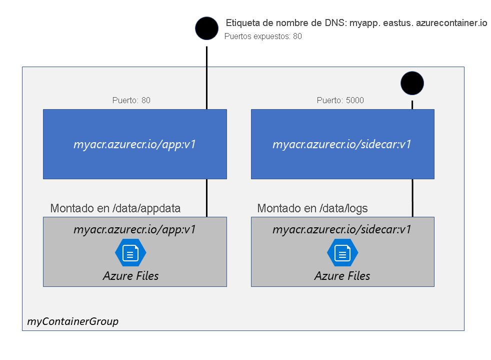

# **Microsoft Certified: Azure Developer Associate - Ejecución de imágenes de contenedor en Azure Container Instances**
## **Temario**
- [**Microsoft Certified: Azure Developer Associate - Ejecución de imágenes de contenedor en Azure Container Instances**](#microsoft-certified-azure-developer-associate---ejecución-de-imágenes-de-contenedor-en-azure-container-instances)
  - [**Temario**](#temario)
  - [**Exploración de Azure Container Instances**](#exploración-de-azure-container-instances)
    - [**Grupos de contenedores**](#grupos-de-contenedores)
      - [**Implementación**](#implementación)
      - [**Asignación de recursos**:](#asignación-de-recursos)
      - [**Redes**](#redes)
      - [**Storage**](#storage)
    - [**Escenarios frecuentes**](#escenarios-frecuentes)

## **Exploración de Azure Container Instances**
Azure Container Instances (ACI): Útil en escenarios de uso de contenedores aislados.
- Aplicaciones simples
- Automatización de tareas
- Trabajos de compilación

Ventajas:
- Inicio rápido: ACI inicia contenedores en segundos
- Acceso al contenedor: Exponer grupos de contenedores a Internet con una IP y un nombre de dominio
- Seguridad de nivel de hipervisor
- Datos del cliente
- Tamaños personalizados
- Almacenamiento persistente: Azure Files para recursos compartidos
- Linux y Windows: Programe contenedores con la misma API.

> Si se requiere orquestación completa, se recomienda **Azure Kubernetes Service (AKS)**

### **Grupos de contenedores**
- Recurso de nivel superior: "Grupo de contenedores"
- Colección de contenedores que se programan en la misma máquina host.
- Comparten ciclo de vida, recursos, red y volúmenes de almacenamiento
- Concepto similar a un "pod" en Kubernetes

> Los grupos de varios contenedores solo se admite en contenedores Linux. Windows solo una instancia.

#### **Implementación**
- Usando plantilla de Resource Manager: Si se necesita implementar recursos adicionales de un servicio de Azure.
- Archivo YAML: Solo instancias del contenedor.

#### **Asignación de recursos**:
ACI asigna mediante la adición de las solicitudes de recursos de cada instancia del grupo.

#### **Redes**
- Comparten dirección IP
- Espacio de nombres de puerto en esa IP
- Se debe exponer puerto en la IP y desde contenedor.
- No se admite asignación de puertos
- Los contenedores dentro de un grupo pueden comunicarse entre sí a través del localhost en los puertos expuestos, incluso si no  se exponen externamente en la IP del grupo.
#### **Storage**
- Puede especificar volúmenes externos a montar dentro de un grupo de contenedores
- Los volumenes admitidos:
  - Recurso compartido de archivos de Azure
  - Key
  - Directorio vacío
  - Repositorio de Git clonado

### **Escenarios frecuentes**
- Quiera dividir una única tarea funcional en un número pequeño de imágenes de contenedor.
Ejemplos:
- Contenedor para aplicación web, otro para extraer contenido reciente desde control de código fuente
- Contenedor de aplicación(genera registro) y otro de registro(recopia y almacena en un recurso)
- Contenedor de aplicación y uno de supervisión(solicitud para verificar que se ejecuta la aplicación)
- Contenedor Front-end y otro Back-end