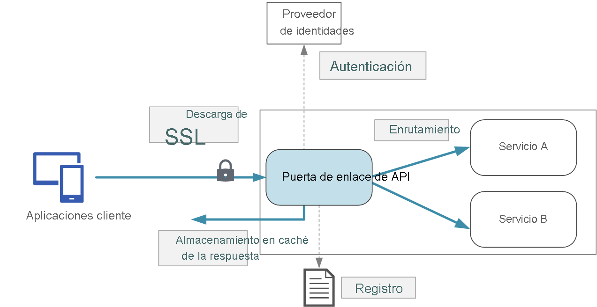

# **Microsoft Certified: Azure Developer Associate - Implementación de API Management**
## **Temario**
- [**Microsoft Certified: Azure Developer Associate - Implementación de API Management**](#microsoft-certified-azure-developer-associate---implementación-de-api-management)
  - [**Temario**](#temario)
  - [**Exploración de API Management**](#exploración-de-api-management)
    - [**Componentes**](#componentes)
    - [**Productos**](#productos)
    - [**Grupos**](#grupos)
      - [**Administradores**](#administradores)
      - [**Desarrolladores**](#desarrolladores)
      - [**Invitados**](#invitados)
    - [**Directivas**](#directivas)
    - [**Portal para desarrolladores**](#portal-para-desarrolladores)
    - [**Exploración de las puertas de enlace de API**](#exploración-de-las-puertas-de-enlace-de-api)
    - [**Exploración de directivas de API Management**](#exploración-de-directivas-de-api-management)
    - [**Descripción de la configuración de directivas**](#descripción-de-la-configuración-de-directivas)
    - [**Protección de las API mediante suscripciones**](#protección-de-las-api-mediante-suscripciones)
    - [**Suscripciones y claves**](#suscripciones-y-claves)
    - [**Protección de las API mediante certificados**](#protección-de-las-api-mediante-certificados)

## **Exploración de API Management**
Ayuda a publicar API para desarrolladores externos, asociados e internos
- **Funcionalidad esencial** para garantizar un programa de API de éxito.
- Una API consta de una o varias operaciones y se puede agregar a uno o varios productos.
- Para usar la API, se debe suscribir a un producto que la contenga y después llamar a la operación de la API

### **Componentes**
- Puerta de enlace de la API:
Extremo que:
  - Acepta llamadas y las enruta a los back-end
  - Comprueba claves API, tokens JWT, certificados y otras credenciales
  - Aplica cuotas de uso y límites de frecuencia
  - Almacena en caché respuestas de back-end (si está configurado)
  - Registra metadatos de llamada para análisis
- Azure Portal:
  - Definir o importar esquema de API
  - Empaquetar API en productos
  - Establecer directivas, cuotas o transformación en las API
  - Obtener información del análisis
  - Administrar usuarios
- Portal para desarrolladores:
  - Documentación de la API
  - Probar una API a través de consola
  - Crear cuenta y suscribirse para obtener claves de API
  - Acceso a análisis

### **Productos**
- Forma de presentar las API a los desarrolladores.
- Constan de titulo, descripción y términos de uso
- Pueden tener 1 o más API
- De tipo **Abierto** o **Protegido**: Uso sin suscripción, Suscripción previa antes de su uso

### **Grupos**
- Administran visibilidad de productos a los desarrolladores
#### **Administradores**
- Miembros del grupo
- Controlan instancias del servicio Administración de API
- Crean API: operaciones y productos que usan los desarrolladores
#### **Desarrolladores**
- Usuarios autenticados del portal para desarrolladores forman este grupo.
- Compilan aplicaciones con sus API
- Luego de concederles acceso, crean aplicaciones: "Operaciones de una API"
#### **Invitados**
- No autenticados: Clientes potenciales,
- Acceso solo lectura
- Ver API pero no llamarlas

### **Directivas**
- Funcionalida de API Management
- Permite cambiar comportamiento de API a través de la configuración.
- Colección de declaraciones que se ejecutan secuencialmente en la solicitud o respuesta de una API
- Ejemplos: conversión de formato de XML a JSON
- Ejemplos: Limitación de tasa de llamadas, etc.
### **Portal para desarrolladores**

### **Exploración de las puertas de enlace de API**
- La solución puede contener varios front-end y back-end

- Una gateway API se ubica entre clientes y servicios.  
- Actúa como un proxy inverso, enrutando las solicitudes de clientes a los servicios.  
- También puede realizar autenticación terminación SSL y limitación de velocidad.  
- Desacopla clientes de servicios
> Si no se implementa una gateway, los clientes deben enviar las solicitudes directamente a los servicios front-end

Funciones de las gateway:
- Enrutamiento de puerta de enlace: Proxy inverso para enrutar las solicitudes a uno o varios servicios de backend mediante enrutamiento capa 7. 
- Agregación de puerta de enlace: Agregar varias solicitudes individuales en una sola. Una operación requiere llamar a varios servicis de backend, los envia a distintos servicios de backend y luego agrego los resultados y devuelve uno unico.
- Descarga de puerta de enlace: descargar funcionalidad de servicios individuales a la puerta de enlace.
  - Terminación SSL
  - Autenticación
  - Lista de permitidos/bloqueados de IP
  - etc. 

### **Exploración de directivas de API Management**
Constituyen una funcionalidad del sistema que permite al editor cambiar el comportamiento de la API.
- Colección de declaraciones secuenciales ejecutadas en solicitud o respueta de API
- Se aplican en la gateway
- La gateway recibe la solicitud y la reenvia sin modificar, pero con la declaración la modifica.

### **Descripción de la configuración de directivas**
- Documento XML guarda la definición
- Configuración dividida en: `inbound` `backend` `outbound` y `on-error`

### **Protección de las API mediante suscripciones**
- Proteger su acceso con claves de suscripción
- Una suscripción es un contenedor con nombre para un par de claves de suscripción.
- Exiten otros mecanismos para proteger acceso a las API

### **Suscripciones y claves**
- Clave de suscripción: cadena única que se pasa en encabezados de solicitud o parámetro de cadena de consulta.
- Puede tener áreas como ámbito

Ámbito|Detalles
---|---
Todas las API|a todas las API desde la gateway
Una sola API|una sola y sus puntos de conexión
Producto|Colección de una o varias API.

- Cada suscripción tiene dos claves: principal y secundaria.
- Facilita la regeneración de una clave

### **Protección de las API mediante certificados**
- TLS entre cliente y gateway API
- Puede permitir que en gateway solo acepte solicitudes con certificados:
  - Entidad de certificación
  - Huella digital
  - Asunto
  - Fecha de expiración

