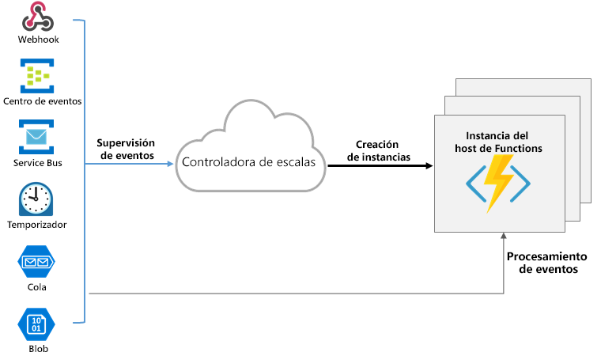
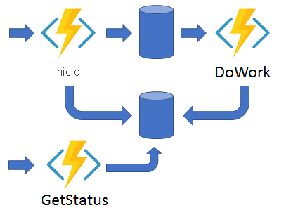
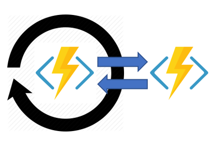
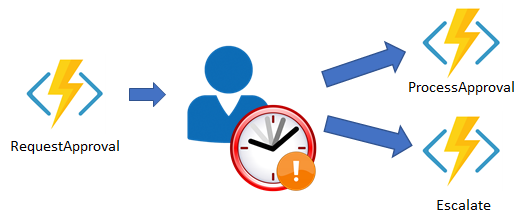

# **Microsoft Certified: Azure Developer Associate - Implementación de Azure Functions**
## **Temario**
- [**Microsoft Certified: Azure Developer Associate - Implementación de Azure Functions**](#microsoft-certified-azure-developer-associate---implementación-de-azure-functions)
  - [**Temario**](#temario)
  - [**Descubrir Azure Functions**](#descubrir-azure-functions)
    - [**Comparativa entre Azure Functions y Azure Logic Apps**](#comparativa-entre-azure-functions-y-azure-logic-apps)
    - [**Comparativa entre Functions y WebJobs**](#comparativa-entre-functions-y-webjobs)
    - [**Comparación de las opciones de hospedaje de Azure Functions**](#comparación-de-las-opciones-de-hospedaje-de-azure-functions)
      - [**Siempre disponible**](#siempre-disponible)
      - [**Requisitos de la cuenta de almacenamiento**](#requisitos-de-la-cuenta-de-almacenamiento)
    - [**Escalado de Azure Functions**](#escalado-de-azure-functions)
    - [**Escalado del entorno de tiempo de ejecución**](#escalado-del-entorno-de-tiempo-de-ejecución)
    - [**Comportamiento de escalado**](#comportamiento-de-escalado)
    - [**Límite de escalabilidad horizontal**](#límite-de-escalabilidad-horizontal)
    - [**Escalado de Azure Functions en un plan de App Service**](#escalado-de-azure-functions-en-un-plan-de-app-service)
  - [**Exploración del desarrollo de Azure Functions**](#exploración-del-desarrollo-de-azure-functions)
    - [**Function app**](#function-app)
    - [**Estructura de carpetas**](#estructura-de-carpetas)
    - [**Entornos de desarrollo locales**](#entornos-de-desarrollo-locales)
    - [**Creación de desencadenadores y enlaces**](#creación-de-desencadenadores-y-enlaces)
      - [**Definiciones de desencadenador y enlace**](#definiciones-de-desencadenador-y-enlace)
      - [**Ejemplo de desencadenador y enlace de Azure Functions**](#ejemplo-de-desencadenador-y-enlace-de-azure-functions)
    - [**Conexión de funciones a servicios de Azure**](#conexión-de-funciones-a-servicios-de-azure)
  - [**Implementación de Durable Functions**](#implementación-de-durable-functions)
    - [**Patrones de aplicación**](#patrones-de-aplicación)
      - [**Diagrama de encadenamiento de funciones**](#diagrama-de-encadenamiento-de-funciones)
      - [**Distribución ramificada de salida y de entrada**](#distribución-ramificada-de-salida-y-de-entrada)
      - [**Las API de HTTP asincrónico**](#las-api-de-http-asincrónico)
      - [**Supervisión**](#supervisión)
      - [**Interacción humana**](#interacción-humana)
      - [**Recursos adicionales**](#recursos-adicionales)
    - [**Descubrimiento de los cuatro tipos de función**](#descubrimiento-de-los-cuatro-tipos-de-función)
      - [**Orquestador**](#orquestador)
      - [**Actividad**](#actividad)
      - [**Entidad**](#entidad)
      - [**Cliente**](#cliente)
    - [**Exploración de centros de tareas**](#exploración-de-centros-de-tareas)
      - [**Recursos de Storage que usa una central**](#recursos-de-storage-que-usa-una-central)
      - [**Adicionales**](#adicionales)
    - [**Exploración de orquestaciones durables**](#exploración-de-orquestaciones-durables)
      - [**Confiabilidad**](#confiabilidad)
      - [**Características y patrones**](#características-y-patrones)
    - [**Control del tiempo en Durable Functions**](#control-del-tiempo-en-durable-functions)
      - [**Limitaciones de los temporizadores**](#limitaciones-de-los-temporizadores)
    - [**Envío y espera de eventos**](#envío-y-espera-de-eventos)

## **Descubrir Azure Functions**
Excelente para trabajar en:
- Procesar datos, imágenes o pedidos
- Integratos sistemas
- IoT
- API simples
- Microservicios

Functions otorga plantillas de escenarios clave.
- Admite **desencadenadores** y **enlaces**(codificar datos de entrada y salida)

### **Comparativa entre Azure Functions y Azure Logic Apps**
- Azure Functions: Servicio de proceso sin servidor
- Azure Logic Apps: Flujos de trabajo sin servidor
Ambos crean orquestación: colección de funciones o pasos.

Mayor granularidad y comparativa: https://docs.microsoft.com/es-es/learn/modules/explore-azure-functions/2-azure-functions-overview

### **Comparativa entre Functions y WebJobs**
**Azure App Service WebJobs** con el SDK de WebJobs es un servicio de integración de tipo código primero que está diseñado para desarrolladores

Mayor granularidad y comparativa: https://docs.microsoft.com/es-es/learn/modules/explore-azure-functions/2-azure-functions-overview

### **Comparación de las opciones de hospedaje de Azure Functions**
Plan de hospedaje para la aplicación de funciones. **Todos admiten Linux y Windows**:
- Consumo
- Premium
- Dedicado (App Service)
- Azure App Service Environment (ASE)
- Kubernetes

Un plan de hospedaje determina:
- Escalabildiad de la aplicación
- Recurso disponible para cada instancia
- Comaptibilidad con funcionalidad avanzada, como conectividad con Virtual Network

Plan|Ventaja
---|---
Consumo|Predeterminado. Escala automáticamente y paga los recursos del proceso. Las instancias se agregan y quitan según número de eventos.
Premium|Escala automáticamente según demanda, mediante trabajos preparados que ejecutan aplicaciones sin retraso, aún después de estar inactivas. Ejecuta en instancias más eficaces y se conecta a redes virtuales.
Dedicado|Usa los recursos y tarfia de un plan de App Service. Mejor para escenarios de ejecución prolongada y no se pueda usar **Durable Functions**
ASE y Kubernetes|Brindan mayor control y aislamiento posibles

#### **Siempre disponible**
Por defecto, En un plan de consumo, la plataforma activa automáticamente las aplicaciones.  
En un plan dedicado, se debe habilitar "**Always On**", caso contrario solo un desencadenador HTTP podrá "reactivar" las funciones.

#### **Requisitos de la cuenta de almacenamiento**
En cualquier plan, Azure Functions usa una cuenta de Azure Storage general que admita Blobs,Colas,Files y Tablas.  
Functions usa las operaciones como administrar desencadenadores y registro de ejecuciones de Azure Storage.

### **Escalado de Azure Functions**
- Plan consumo y premium, se escala los recursos incorporando **instancias adicionales**. El número de estas se calcula sobre número de eventos que desencadenan función.

Cada instancia de plan de consumo tiene 1.5 GB de memoria y una CPU. En plan Prémium el tamaño del plan determina su memoría y CPU para todas las aplicaciones.

Los archivos de código se almacenan en recursos compartidos de Azure Files. 

### **Escalado del entorno de tiempo de ejecución**
Functions usa un componente **Controlador de escala** para supervir tasa de ventos y saber si debe escalar horizontalmente. El controlador usa la heurística para **cada tipo de desencadenador**(Como Azure Queue Storage).

La unidad de escala de Azure Functions es "App Functions".
Se le asignan recursos adicionales para ejecutar varias instancias del host.



> El controlador puede reducir horizontalmente hasta cero cuando no se ejecuta ninguna función en la App Functions

>La latencia agregada al escalar de cero a uno(en instancia) se conoce como **arranque en frío**

### **Comportamiento de escalado**
- El comportamiento varia en función de muchos factores
- El realizarse también,según el desencadenador y lenguaje seleccionado
- Otros:
  1. Número máximo de instancias: Una App Functions solo escala hasta 200 instancias en Consumo y 100 en Premium.
  2. Nueva tasa de instancias: En desencadenadores HTTP, solo se asigna nuevas instancias como máximo una vez cada segundo. Para los que no lo son, solo se asignan nuevas instancias como máximo una vez cada 30 segundos.

### **Límite de escalabilidad horizontal**
Puede limitar el número máximo de instancias, cuando tienen un componente de nivel inferior tiene un rendimiento limitado.  
`functionAppScaleLimit` para especificar el máximo. Se establece en `0` o `null` si no hay restricciones, o un valor de `1` y `200|100`

### **Escalado de Azure Functions en un plan de App Service**
- Forma manual para agregar más instancias
- Escalado automático, aunque es más lento que la escala elástica del plan Premium.

## **Exploración del desarrollo de Azure Functions**
Una función contiene:
- Código (en diversos lenguajes)
- Configuracción (function.json): Con lenguajes compilados, se genera automáticamente. Caso contrario se debe proporcionar el archivo de configuración

**function.json**: Define desencadenador de función, enlaces y otras opciones.
- Cada función tiene un solo desencadenador.
- Se usa en tiempo de ejecución para determinar que eventos se supervisará y cómo pasar datos y devolverlos.

Ejemplo: 
```json
{
    "disabled":false,
    "bindings":[
        // ... bindings here
        {
            "type": "bindingType",
            "direction": "in",
            "name": "myParamName",
            // ... more depending on binding
        }
    ]
}
```

- `bindings`: Configura enlaces y desencadenadores 
- Cada enlace comparte ajustes de configuración comunes y algún parámetro específico de un determinado tipo de enlace.

Cada enlace requiere:
Propiedad|Tipos|Comentarios
---|---|---
`type`|string|Nombre de enlace. Ejemplo: `queueTrigger`
`direction`|string|Si enlace recibe o enviar datos. Ejemplo: `in` o `out`
`name`|string|Nombre a usar para los datos enlazados. Ejemplo: `myQueue `

### **Function app**
- Proporciona un contexto de ejecución donde ejecutar las funciones
- Unidad de implementación y administración de funciones
- Se compone de varias funciones individuales que se administran, implementan y escalan conjuntamente.
- Todas las funciones comparten el mismo plan de precios, método de implementación y versión en tiempo de ejecución
- Es una forma de organizar y administrar las funciones de manera colectiva

### **Estructura de carpetas**
El código de todas las funciones está ubicado en una carpeta. Esta carpeta contiene un archivo de configuración de host.
***host.json*** contiene configuración específica del entorno de ejecución. Una carpeta ***bin*** contiene paquetes y otros archivos de bibliotecas que requiere la Function App. La estructura varia según lenguaje.

Mayor granularidad: https://docs.microsoft.com/es-es/learn/modules/develop-azure-functions/2-azure-function-development-overview

### **Entornos de desarrollo locales**
Es posible usar editor de código y herramientas de desarrollo preferidas para crear y probar funciones en un equipo local.
- Las funciones locales se conectan a servicios de Azure en directo, y puede depurar sus funciones en el equipo local.
- El desarrollo local depende del lenguaje y herramientas que prefiera.
Consultar para mayor información: https://docs.microsoft.com/es-es/azure/azure-functions/functions-develop-local

### **Creación de desencadenadores y enlaces**
- Desencadenadores provocan que una función se ejecute
- Define cómo se invoca una función.
- Cada función debe tener 1 desencadenador
- Tienen datos asociados (a menudo son la carga de la función)
- El enlace es una conexión con otro recurso mediante declaraciones
- Pueden ser de entrada, salida o ambos.
- Los datos de los enlaces se pasan como parametros
- Cada función puede tener uno o varios enlaces y los puede combinar

#### **Definiciones de desencadenador y enlace**
Se definen diferente en función del lenguaje de desarrollo
Idioma|Los desencadenadores y enlaces se configuran por...
---|---
C#|Decoración de métodos y parámetros con atributos de C#
Java|Decoración de métodos y parámetros con anotaciones de Java
JavaScript/PowerShell/Python/TypeScript|function.json

#### **Ejemplo de desencadenador y enlace de Azure Functions**
Caso:
- Escribir una fila nueva en **Azure Table Storage**
- El contenido lo da un mensaje en **Azure Queue Storage**

Implementación:
- Desencadenador de **Azure Queue Storage** (Activa función)
- Enlace de salida: **Azure Table Storage**

*function.json*:
```json
{
  "bindings": [
    {
      "type": "queueTrigger",
      "direction": "in",
      "name": "order",
      "queueName": "myqueue-items",
      "connection": "MY_STORAGE_ACCT_APP_SETTING"
    },
    {
      "type": "table",
      "direction": "out",
      "name": "$return",
      "tableName": "outTable",
      "connection": "MY_TABLE_STORAGE_ACCT_APP_SETTING"
    }
  ]
}
```

Si quiere ver el desarrollo a profundidad. Revisar: https://docs.microsoft.com/es-es/learn/modules/develop-azure-functions/3-create-triggers-bindings

### **Conexión de funciones a servicios de Azure**
Están declaradas en **function.json**, pero los detalles estarán como variable de entorno a través de la configuración de la aplicación.

Mayor información: https://docs.microsoft.com/es-es/learn/modules/develop-azure-functions/4-connect-azure-services

## **Implementación de Durable Functions**
- Define flujos de trabajo con estado mediante escritura de funciones de orquestador 
- Define entidades con estado mediante la escritura de funciones de entidad
- La extensión administra el estado, puntos de comprobación y reinicios. Dejando que solo se centre en la lógica de negocios.

### **Patrones de aplicación**
- Caso de uso principal: Simplificar requisitos de coordinación con estados complejos cómo:
  1. Diagrama de encadenamiento de funciones
  2. Distribución ramificada de salida y de entrada
  3. Las API de HTTP asincrónico
  4. Supervisión
  5. Interacción humana

Más información: https://docs.microsoft.com/es-es/learn/modules/implement-durable-functions/2-durable-functions-overview

#### **Diagrama de encadenamiento de funciones**
Secuencia de funcione se ejecutan en un orden. La salida de una función es entrada de otra.


#### **Distribución ramificada de salida y de entrada**
Es posible ejecución paralela de funciones y se espera que finalicen.


#### **Las API de HTTP asincrónico**
Soluciona problema de coordinar el estado de las operaciones de larga duración con los clientes externos.


#### **Supervisión**
Proceso flexible y periódico en un flujo de trabajo. Sondear hasta que se cumplan condiciones específicas.


#### **Interacción humana**
Permiten esta interacción mediante uso de tiempos de expiración y lógica de compensación


#### **Recursos adicionales**
Para aprender sobre las diferencias entre Durable Functions 1.x y 2.x, visite:
[Información general sobre las versiones de Durable Functions](https://docs.microsoft.com/es-es/azure/azure-functions/durable/durable-functions-versions)

### **Descubrimiento de los cuatro tipos de función**
- Orquestador
- Actividad
- Entidad
- Cliente

#### **Orquestador**
Describe cómo se ejecutan las acciones y su orden. Pueden interactuar con funciones de entidad. El código debe ser determinista.  
Mayor detalle: [Restricciones de código de las funciones de orquestador](https://docs.microsoft.com/es-es/azure/azure-functions/durable/durable-functions-code-constraints)
#### **Actividad**
Unidad básica de trabajo en una **Orquestación**. Pueden ejecutarse en serie,paralelo o combinados.
#### **Entidad**
Definen operaciones de lectura y actualización de pequeños fragmentos de estado. Se hace referencia a estos estados como entidades duraderas.  
Las desencadena un **desencadenador de entidad**. Pueden ser invocados desde funciones de cliente u orquestador.
#### **Cliente**
Las orquestador y entidad se desencadenan mediante enlaces reaccionando a mensajes dentro de una cola en un centro de tareas. La manera de entregar estos mensajes es en un enlace de cliente (de orquestados , o de entidad) **desde una función de cliente**.  
Lo que hace a una función, cliente es como usa el **enlac de salida de cliente durable**.

### **Exploración de centros de tareas**
Contenedor lógico de recursos de almacenamiento duraderos que se usan en orquestaciones y entidades. Estas dos últimas y de actividad solo pueden interactuar si son de la misma central de tareas.

- Una cuenta de almacenamiento puede contener varias centrales de tareas y varias aplicación de función (la cuenta de almacenamiento). Puede configurar cada central para tener sus aplicaciones asociadas.

#### **Recursos de Storage que usa una central**
- Colas de control
- Cola de elementos de trabajo
- Tabla de historial
- Tabla de instancias
- Contenedores blob
- Contenedor para cargas de mensajes grandes, si procede.

Todo se crea automáticamente cuando se ejecutan funciones de orquestados, entidad o actividad. 

#### **Adicionales**
- El nombre de la central de tareas se declara en *host.json*
```json
{
  "version": "2.0",
  "extensions": {
    "durableTask": {
      "hubName": "MyTaskHub"
    }
  }
}
```
### **Exploración de orquestaciones durables**
- Organizar ejecución de otras funciones.
- Pueden llamar de forma sincrónica o asincrónica a otras funciones duraderas
- El estado local no se pierde si el proceso se recicla o reinicia la VM
#### **Confiabilidad**
Aprovisiona eventos de forma transparente. Anexa confirmación de llamadas a eventos en un historial de ejecución de la instancia de orquestación.
- Se guarda en una tabla de almacenamiento.
- La acción de confirmación agrega mensajes a una cola para programar el trabajo real.
Estos dos pasos ya pueden permitir que el orquestado se descargue de memoria.
#### **Características y patrones**
Patrón o característica|Descripción
---|---
Sub-orquestaciones|Llamadas a otras orquestaciones menores, incluso en paralelo.
Temporizadores durables|Reemplazan `Thread.Sleep`,`Task.Delay`,`setTimeout()`,`setInterval()`,etc. 
Eventos externos|Pueden esperarlos para actualizar una instancia de orquestación. Útil para controlar interacciones humanas u otras devoluciones de llamadas externas.
Control de errores|Se admite `try/catch`
Secciones críticas|No preocuparse por condiciones de carrera. A menos que interactuen con sistemas externos.
Llamadas a puntos de conexión HTTP|No se permite operaciones E/S en orquestado
Paso de varios parámetros|No es posible. Pasar en matriz de objetos

### **Control del tiempo en Durable Functions**
Proporciona temporizadores durables para configurar tiempos de expiración en acciones asincrónicas o implementar retrasos.

#### **Limitaciones de los temporizadores**
Si se crea un temporizador que expira a las 16:30. La instancia **Durable Task Framework** subyacente pone en cola un mensaje que es visible solo a las 16:30. 

Más implementaciones: https://docs.microsoft.com/es-es/learn/modules/implement-durable-functions/6-timers-durable-functions

### **Envío y espera de eventos**
Capacidad de esperar y escuchar eventos externos. Útil para controlar interacción humana o desencadenadores externos.

Implementación de envío y espera: https://docs.microsoft.com/es-es/learn/modules/implement-durable-functions/7-external-events-durable-functions