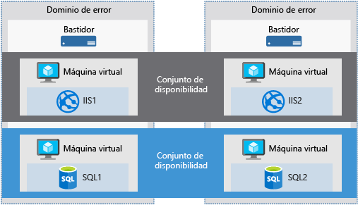
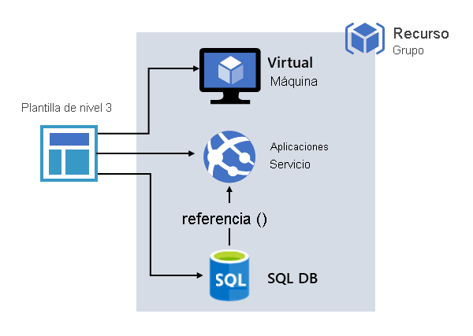

# **Microsoft Certified: Azure Developer Associate - Implementación de soluciones de infraestructura como servicio**
## **Temario**
- [**Microsoft Certified: Azure Developer Associate - Implementación de soluciones de infraestructura como servicio**](#microsoft-certified-azure-developer-associate---implementación-de-soluciones-de-infraestructura-como-servicio)
  - [**Temario**](#temario)
  - [**Aprovisionamiento de máquinas virtuales en Azure**](#aprovisionamiento-de-máquinas-virtuales-en-azure)
    - [**Extensiones de máquina virtual**](#extensiones-de-máquina-virtual)
      - [**Windows**](#windows)
      - [**Linux**](#linux)
    - [**Comparación de las opciones de disponibilidad de las máquinas virtuales**](#comparación-de-las-opciones-de-disponibilidad-de-las-máquinas-virtuales)
      - [**Zonas de disponibilidad**](#zonas-de-disponibilidad)
      - [**Conjuntos de disponibilidad**](#conjuntos-de-disponibilidad)
      - [**Dominios de error**](#dominios-de-error)
      - [**Dominios de actualización**](#dominios-de-actualización)
      - [**Conjuntos de escalado de máquinas virtuales**](#conjuntos-de-escalado-de-máquinas-virtuales)
    - [**Determinación del tamaño correcto de la máquina virtual**](#determinación-del-tamaño-correcto-de-la-máquina-virtual)
  - [**Creación e implementación de plantillas de Azure Resource Manager**](#creación-e-implementación-de-plantillas-de-azure-resource-manager)
    - [**Razones para utilizar plantillas de Azure Resource Manager**](#razones-para-utilizar-plantillas-de-azure-resource-manager)
    - [**Archivo de plantilla**](#archivo-de-plantilla)
    - [**Implementación de soluciones de varios niveles**](#implementación-de-soluciones-de-varios-niveles)
      - [**Definición de plantillas de varios niveles**](#definición-de-plantillas-de-varios-niveles)
      - [**Uso compartido de plantillas**](#uso-compartido-de-plantillas)
    - [**Exploración de la implementación condicional**](#exploración-de-la-implementación-condicional)
      - [**Recurso nuevo o existente**](#recurso-nuevo-o-existente)
    - [**Funciones en tiempo de ejecución**](#funciones-en-tiempo-de-ejecución)
    - [**Establecimiento del modo de implementación correcto**](#establecimiento-del-modo-de-implementación-correcto)
  - [**Administración de imágenes de contenedor en Azure Container Registry**](#administración-de-imágenes-de-contenedor-en-azure-container-registry)
    - [**Niveles del servicio Azure Container Registry**](#niveles-del-servicio-azure-container-registry)
    - [**Imágenes y artefactos admitidos**](#imágenes-y-artefactos-admitidos)
    - [**Exploración de las funcionalidades de almacenamiento**](#exploración-de-las-funcionalidades-de-almacenamiento)
    - [**Compilación y administración de contenedores con tareas**](#compilación-y-administración-de-contenedores-con-tareas)
      - [**Escenarios de ACR Task**](#escenarios-de-acr-task)
    - [**Exploración de los elementos de un Dockerfile**](#exploración-de-los-elementos-de-un-dockerfile)

## **Aprovisionamiento de máquinas virtuales en Azure**
Una VM aún requiere tareas de:
- Configuración
- Aplicar revisiones
- Instalar software que se ejecutará


- Disponibilidad: Llega al 99.9% si se usa Premium Storage
- Límites: 20 VM´s por región. Se aumentan rellenando una [incidencia de soporte técnico para solicitar un incremento](https://docs.microsoft.com/es-es/azure/azure-portal/supportability/regional-quota-requests)
- Tipos de discos: 
  - Estándar: HDD
  - Premium: SSD
- Almacenamiento en disco:
  - Administrado: Recientes y administrados por Azure. Hasta 4TB.
  - No administrado: Usted es responsable de las cuentas de almacenamiento que contienen los discos duros virtuales (VHD). Una cuenta de almacenamiento tiene limite de 20 000 E/S, es decir, puede admitir 40 VHD estándar a pleno uso.

### **Extensiones de máquina virtual**
Proporcionan funcionalidades adicionales a la VM.
- Ejecutar scripts personalizados
- Implementar y administrar configuraciones
- Recopilar datos de diagnóstico
#### **Windows**
- Puede configurar cargas de trabajo en la VM al ejecutar un script
- Desired State Configuration de PowerShell ayuda a configurar DSC
- Azure Diagnostics configura la VM para que recopile datos de diagnóstico para supervisar estado de app.
#### **Linux**
- Admite cloud-init en la mayoría de las distros.
- Funciona con todas las principales herramientas de automatización: Ansible, Chef, SaltStack y Puppet

### **Comparación de las opciones de disponibilidad de las máquinas virtuales**
#### **Zonas de disponibilidad**
Existen:
- Servicios de zona: Recurso de ancla a una zona específica (VM,Discos,IP)
- Servicios de redundancia de zona: Azure replica entre zonas (Almacenamiento con ZRS, SQL Database).

#### **Conjuntos de disponibilidad**
Agrupación lógica de VM. Permite conocer cómo se crea su aplicación logrando:
- Brindar redudancia y disponibilidad
- Consta de Dominios de error (FD) y de actualización (UD) : Protegen contra errores de hardware y permiten actualizaciones seguras

#### **Dominios de error**
Grupo lógico de hardware subyacente:
- Comparte fuente de alimentación y conmutador de red
- Limitan el impacto de potenciales errores.



#### **Dominios de actualización**
Grupo lógico de hardware más subyacente que el de error:
- Puede entrar en mantenimiento o reiniciarse al mismo tiempo


#### **Conjuntos de escalado de máquinas virtuales**
Crear y administrar un grupo de VM con equilibrio de carga.
- El equilibrador de carga es : **Azure Load Balancer**.
**Azure Load Balancer**: Es un equilibrador de carga de nivel 4 (TCP,UDP).
- Distribuye el tráfico entrante entre VM con un estado correcto.
- Sondea un puerto determinado de una VM y distribuye tráfico a una VM operativa.

- Se define una IP o varias de front-end públicas. Permite acceso a través de internet
- Las VM se conectan mediante su tarjeta de interfaz de red (NIC) al equilibrador de carga
- Definen reglas al equilibrador,puertos y protocolos.

### **Determinación del tamaño correcto de la máquina virtual**
Tipo de VM|Descripción|Uso
---|---|---
Uso general|Equilibrio entre CPU y memoria| Desarrollo y pruebas. Databases pequeñas o medianas. Servidores web de tráfico bajo o medio
Optimizada para proceso|Uso mayor en CPU que memoria|Servidores web de tráfico medio, aplicaciones de red, procesos por lotes y servidores de aplicaciones
Memoria optimizada|Memoria alta que CPU. |Bases de datos relacionales. Memorias caché de capacidad media o grande y análisis en memoria.
Optimizada para almacenamiento|Alto E/S y de disco.|Macrodatos, SQL y NoSQL, Almacenamiento de datos y Databases transaccionales grandes.
GPU|Dispone de uno o más GPU´s|Gráficos pesados y edición de vídeo.Inferencia y entrenamiento de modelos con Deep Learning.
Informática de alto rendimiento|CPU más rápidas y con interfaces de red de alto rendimiento|

## **Creación e implementación de plantillas de Azure Resource Manager**
**Azure Resource Manager** proporciona administración:
- Crear
- Actualizar
- Eliminar
recursos de su **suscripción** de Azure.

Todas las solicitudes de cualquier de las herramientas, API o SDK de Azure,
Resource Manager las recibe, autentica y autoriza.

-> Posteriomrnete Resource Manager envía la solicitud al servicio de Azure que ejecuta la acción.  
-> Como todas las solicitudes se controlan en una misma API, verá resultados y funcionalidades coherentes en todas las herramientas.  


### **Razones para utilizar plantillas de Azure Resource Manager**
Ventajas de usar plantillas:
- Sintaxis declarativa que permite implementar todo tipo de recurso
- Resultados repetibles y coherentes
- Orquestación: Resource Manager se encarga de gestionar la implementación de recursos interdependientes para que se creen en el orden correcto.
> Si es posible, Resource Manager implementa recursos en paralelo.

### **Archivo de plantilla**
Contiene:
- **Parámetros**: Valores que permitan usar la plantilla en entornos diferentes
- **Variables**: 
- **Funciones definidas por el usuario**:
- **Recursos**: Especificar recursos que se implementan
- **Salidas**: Devolver valores de los recursos implementados

### **Implementación de soluciones de varios niveles**
- Las plantillas (formato JSON) definen la infraestructura y configuración de su solución en Azure.
- **Resource Manager** convierte la plantilla en operaciones de API de REST.
Ejemplo:

```json
"resources": [
  {
    "type": "Microsoft.Storage/storageAccounts",
    "apiVersion": "2019-04-01",
    "name": "mystorageaccount",
    "location": "westus",
    "sku": {
      "name": "Standard_LRS"
    },
    "kind": "StorageV2",
    "properties": {}
  }
]
```
Convierte la definición en esta operación de API REST que se envía al proveedor de recurso `Microsoft.Storage`:
```http
PUT
https://management.azure.com/subscriptions/{subscriptionId}/resourceGroups/{resourceGroupName}/providers/Microsoft.Storage/storageAccounts/mystorageaccount?api-version=2019-04-01
REQUEST BODY
{
  "location": "westus",
  "sku": {
    "name": "Standard_LRS"
  },
  "kind": "StorageV2",
  "properties": {}
}
```

#### **Definición de plantillas de varios niveles**
La definición de plantillas y grupos de recursos depende solo de nosotros, así como la administración de la solución.  
Es posible incluir toda la infraestructura en una sola plantilla, aunque tiene sentido dividir los requisitos en conjunto de plantillas seleccionadas.
Ejemplo:



Para implementar la solución concreta, cree una plantilla maestra que vincula todas las plantillas necesarias.  
La imagen muestra como es implementar una solución de tres niveles mediante una plantilla maestra que incluye 3 anidadas


- Si desea que cada nivel tenga su ciclo de vida, debe implementarlos en grupos de recursos independientes.
- Permite también la actualización. Si la plantilla especifica creación, pero ya existe el recurso, Resource Manager realiza la actualización, en lugar de crear otro.
- Actualiza el activo existente al mismo estado que tendría si fuese nuevo.

#### **Uso compartido de plantillas**
- Es posible almacenar plantilla como un tipo de recurso.
- Con esto, es posible usar RBAC para conceder acceso
- Acceso de lectura = Implementar, pero no cambiar

### **Exploración de la implementación condicional**
- Se puede implementar un recurso en la plantilla
- Usando el elemento `condition`. Si es `true`, se crea el recurso,Si es `false` no se crea el recurso.
> No aplica en cascada a los recursos secundarios

#### **Recurso nuevo o existente**
Ejemplo: Implementar una cuenta de almacenamiento nueva o usar una existente.  
Contiene un parámetro denominado `newOrExisting` que se usa como condición en la sección `resources`.
```json
{
  "$schema": "https://schema.management.azure.com/schemas/2019-04-01/deploymentTemplate.json#",
  "contentVersion": "1.0.0.0",
  "parameters": {
    "storageAccountName": {
      "type": "string"
    },
    "location": {
      "type": "string",
      "defaultValue": "[resourceGroup().location]"
    },
    "newOrExisting": {
      "type": "string",
      "defaultValue": "new",
      "allowedValues": [
        "new",
        "existing"
      ]
    }
  },
  "functions": [],
  "resources": [
    {
      "condition": "[equals(parameters('newOrExisting'), 'new')]",
      "type": "Microsoft.Storage/storageAccounts",
      "apiVersion": "2019-06-01",
      "name": "[parameters('storageAccountName')]",
      "location": "[parameters('location')]",
      "sku": {
        "name": "Standard_LRS",
        "tier": "Standard"
      },
      "kind": "StorageV2",
      "properties": {
        "accessTier": "Hot"
      }
    }
  ]
}
```
> Cuando el parámetro newOrExisting está establecido en new, la condición se evalúa como true. Se implementa la cuenta de almacenamiento. Sin embargo, cuando newOrExisting está establecido existing, la condición se evalúa como false y no se implementa la cuenta de almacenamiento.

### **Funciones en tiempo de ejecución**
- Si existe una función `reference` o `list` con un recurso condicional, la función se evalúa incluso si no se implementa el recurso generando un error de referencia.
- Se debe usar función `if` para aseugrar que la función se evalúe solo cuando se implementa el recurso

### **Establecimiento del modo de implementación correcto**
`En ambos modos, Resource Manager intenta crear todos los recursos especificados`
- Si recurso existe y configuración es igual -> No se realiza operación en recurso
- Si cambia valores de propiedad de recurso -> recurso se actualiza con esos valores
- Si actualiza ubicación o tipo de recurso -> Error.

Si se implementa recursos, se debe indicar que es:
- **Modo completo**:
Resource Manager **elimina** los recursos que existen en el grupo de recursos, pero que no se especifican en la plantilla.
- **Modo incremental**:
Resource Manager **deja sin modificar** los recursos que existen en el grupo de recursos pero que no se especifican en la plantilla.

Mayor información: https://docs.microsoft.com/es-es/learn/modules/create-deploy-azure-resource-manager-templates/5-azure-resource-manager-deployment-modes

## **Administración de imágenes de contenedor en Azure Container Registry**
**Azure Container Registry (ACR)**: Servicio de registro de Docker administrado y privado. Se basa en Docker Registry 2.0.
- Cree y mantenga registros de Azure Container para almacenar y administrar imágenes privadas del contenedor Docker.


**Casos de uso** Extraiga imágenes dsde un registro de contenedor a varios destinos de implementación:
- **Sistema de orquestación escalables** que administran aplicaciones en contenedores en clústeres de host, Kubernetes, DC/OS y Docker Swarm. 
- **Servicios de Azure**: Creación y ejecución de aplicaciones a escala: Azure Kubernetes Services (AKS), App Service, Batch, Service Fabric y otros.

También se puede insertar en un registro de contenedor como parte de un flujo de trabajo:
- Herramientas de entrega e integración continua como Azure **Pipelines** o **Jenkins**

### **Niveles del servicio Azure Container Registry**
Nivel|Descripción
---|---
Básico|Optimizado en costos para desarrollo. Almacenamiento y rendimiento de imágenes inferior a los otros planes. Las mismas funcionalidades que los otros planes.
Estándar|Mayor almacenamiento y rendimiento de imágenes. Escenarios de producción.
Premium|La mayor cantidad de almacenamiento, operaciones simultáneas, replicación geográfica, confianza de contenido para la firma de etiquetas de imagen y vínculo privado con puntos de conexión privados.

### **Imágenes y artefactos admitidos**
- Las imágenes se agrupan en un repositorio.
- Cada imágen es solo lectura
- Se incluye imágenes de Windows y Linux
- También se almacena formatos de contenido relacionado: Gráfos de Helm o los Open Container Initiative (OCI).

### **Exploración de las funcionalidades de almacenamiento**
Todas las instancias en Azure Container Registry gozan como máximo de:
- Cifrado en reposo:
- Almacenamiento regional:
- Redundancia de zona
- Almacenamiento escalable

### **Compilación y administración de contenedores con tareas**
Con ACR Tasks que es un conjunto de características que se encuentran enACR. Proporciona la creación de imágenes basadas en la nube para Linux,Windows,ARM  y puede automatizar la aplicación de revisiones de S.O y maroc para los contenedores de Docker.
- Permite actualizaciones de código fuente
- Actualizaciones de imágen base de un contenedor
- Temporizadores

#### **Escenarios de ACR Task**
- Tarea rápida: Compilar e insertar una imágenes en ACR.
- Tareas desencadenadas automáticamente: Habilitar 1 o varios desencadenadores para compilar imagen:
  - Al actualizar código fuente
  - Al actualizar imágen base
  - De acuerdo a una programación
- Tarea de varios pasos: Funcionalidad de inserción y compilación de 1 imagen de ACR Tasks con flujos de trabajo basado en varios contenedores y pasos.

> Cada tarea de ACR tiene un contexto de código fuente asociado.

Más información de los escenarios: https://docs.microsoft.com/es-es/learn/modules/publish-container-image-to-azure-container-registry/4-azure-container-registry-tasks

### **Exploración de los elementos de un Dockerfile**
Sobre Dockerfile: https://docs.microsoft.com/es-es/learn/modules/publish-container-image-to-azure-container-registry/5-dockerfile-components