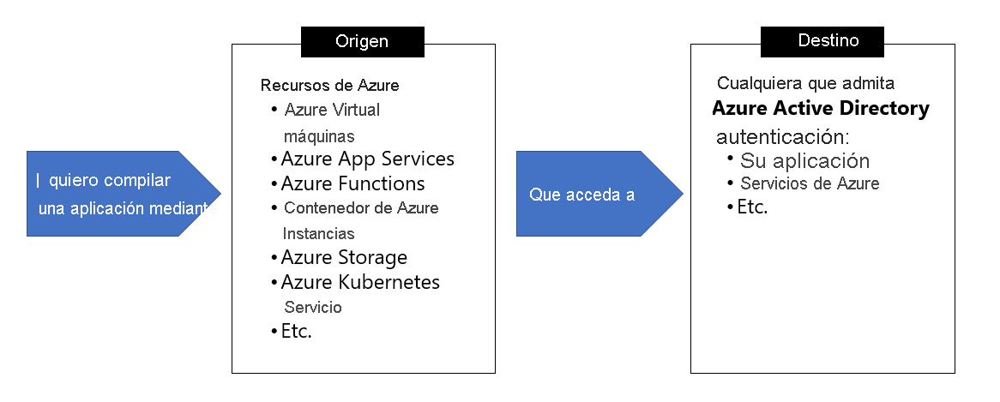

# **Microsoft Certified: Azure Developer Associate - Implementación de soluciones en la nube seguras**
## **Temario**
- [**Microsoft Certified: Azure Developer Associate - Implementación de soluciones en la nube seguras**](#microsoft-certified-azure-developer-associate---implementación-de-soluciones-en-la-nube-seguras)
  - [**Temario**](#temario)
  - [**Implementación de Azure Key Vault**](#implementación-de-azure-key-vault)
    - [**Principales ventajas de usar Azure Key Vault**](#principales-ventajas-de-usar-azure-key-vault)
    - [**Información sobre los procedimientos recomendados de Azure Key Vault**](#información-sobre-los-procedimientos-recomendados-de-azure-key-vault)
      - [**Autenticación**](#autenticación)
    - [**Cifrado de datos en tránsito**](#cifrado-de-datos-en-tránsito)
    - [**Procedimientos recomendados de Azure Key Vault**](#procedimientos-recomendados-de-azure-key-vault)
    - [**Autenticación en Azure Key Vault**](#autenticación-en-azure-key-vault)
    - [**Autenticación en Key Vault en el código de la aplicación**](#autenticación-en-key-vault-en-el-código-de-la-aplicación)
  - [**Implementación de identidades administradas**](#implementación-de-identidades-administradas)
    - [**Tipos de identidades administradas**](#tipos-de-identidades-administradas)
    - [**Cuándo se deben usar las identidades administradas**](#cuándo-se-deben-usar-las-identidades-administradas)
    - [**¿Qué servicios de Azure admiten las identidades administradas?**](#qué-servicios-de-azure-admiten-las-identidades-administradas)
  - [**Implementación de Azure App Configuration**](#implementación-de-azure-app-configuration)
    - [**Creación de claves y valores emparejados**](#creación-de-claves-y-valores-emparejados)
      - [**Claves**](#claves)
      - [**Diseño de espacios de nombres de clave**](#diseño-de-espacios-de-nombres-de-clave)
      - [**Claves de etiqueta**](#claves-de-etiqueta)
      - [**Valores de clave de consulta**](#valores-de-clave-de-consulta)
      - [**Valores**](#valores)
    - [**Administración de características de la aplicación**](#administración-de-características-de-la-aplicación)
    - [**Protección de los datos de configuración de aplicaciones**](#protección-de-los-datos-de-configuración-de-aplicaciones)
      - [**Cifrado de datos de configuración mediante claves administradas por el cliente**](#cifrado-de-datos-de-configuración-mediante-claves-administradas-por-el-cliente)
      - [**Habilitación de la funcionalidad de clave administrada por el cliente**](#habilitación-de-la-funcionalidad-de-clave-administrada-por-el-cliente)
      - [**Uso de puntos de conexión privados para Azure App Configuration**](#uso-de-puntos-de-conexión-privados-para-azure-app-configuration)

## **Implementación de Azure Key Vault**
Admite dos tipos de contenedores:
- Almacenes: Software,Claves,Secretos y certificados respaldados por HSM
- Grupos de módulos de seguridad de hardware administrados (HSM): Solo claves respaldadas por HSM.

Dos niveles de servicio:
- Estándar: cifrado con una clave de software
- Premium: claves protegidas mediante HSM

### **Principales ventajas de usar Azure Key Vault**
- Secretos de aplicación centralizados
- Almacenamiento seguro de secretos y claves
- Supervisión del acceso y uso: Habilitando el registro para los almacenes.
- Administración simplificada de secretos de aplicación

### **Información sobre los procedimientos recomendados de Azure Key Vault**
#### **Autenticación**
Cualquier operación con Key Vault, deberá autenticarse en la solución primero:
- **Identidades administradas de recursos de Azure** 
- **Entidad de servicio y certificado** 
- **Entidad de servicio y secreto**

### **Cifrado de datos en tránsito**
- Aplica el protocolo Seguridad de la capa de transporte (TLS)
- Confidencialidad directa total (PFS) protege las conexiones entre los sistemas cliente y los servicios en la nube de Microsoft mediante claves únicas.
- Las conexiones también usan longitudes de clave de cifrado RSA de 2048 bits

### **Procedimientos recomendados de Azure Key Vault**
- Uso de almacenes de claves independientes: 1 almacén por aplicación y por entorno(desarrollo,preproducción y producción).
- Control del acceso al almacén: Permitirselo solo a aplicaciones y usuarios autorizados
- Copia de seguridad: Periodicamente cree copias
- Registro: Activarlo y las alertas
- Opciones de recuperación: Active eliminación temporal

### **Autenticación en Azure Key Vault**
- Funciona junto con Azure AD:
  - Habilitar identidad administrada
  - O Registrar aplicación con su inquilino de Azure AD.

### **Autenticación en Key Vault en el código de la aplicación**
SDK para cada uno
- .NET
- Python
- Java
- JavaScript

También es posible con REST

## **Implementación de identidades administradas**
Las identidades administradas eliminan la necesidad de que los desarrolladores administren las credenciales.

- Proporcionan una identidad que usan las aplicaciones al conectarse a recurso que admiten la autenticación de Azure AD.

### **Tipos de identidades administradas**
- **Asignadas por el sistema**: Se habilitan y se crea una identidad en el inquilino de Azure AD de confianza. Las credenciales de la identidad se aprovisionan en la instancia
- **Asignadas por el usuario**: Se crean como recursos independientes. Esta puede asignarse a una o varias instancias de servicio de Azure.

> Internamente, las identidades administradas son **entidades de servicio de tipo especial**. Se bloquean para solo usarse en recursos de Azure.

### **Cuándo se deben usar las identidades administradas**



### **¿Qué servicios de Azure admiten las identidades administradas?**
Aquellos compatibles con la autenticación de Azure AD.

## **Implementación de Azure App Configuration**
Proporciona servicio para administrar la configuración de la aplicación y las marcas de características de forma centralizada.

Ventajas:
- Servicio totalmente administrado
- Representaciones y asignaciones de claves flexibles
- Etiquetado
- Reproducción de la configuración en un momento dado
- Seguridad mejorada mediante identidades administradas de Azure
- etc

Más información: https://docs.microsoft.com/es-es/training/modules/implement-azure-app-configuration/2-app-configuration-overview

### **Creación de claves y valores emparejados**
#### **Claves**
- Caracteres reservados `*`, `,` y `\`
- Límite de tamaño combinado de 10mil caracteres en un par clave-valor
#### **Diseño de espacios de nombres de clave**
```text
# Según servicios de los componentes
AppName:Service1:ApiEndpoint
AppName:Service2:ApiEndpoint

# Según las regiones de implementación
AppName:Region1:DbEndpoint
AppName:Region2:DbEndpoint
```

#### **Claves de etiqueta**
- Forma predeterminada la etiqueta de un valor de clave es `null`
- Una clave app1 con etiquetas A y B forma dos claves independientes
- Manera cómoda de crear variantes de una clave.
```text
Key = AppName:DbEndpoint & Label = Test
Key = AppName:DbEndpoint & Label = Staging
Key = AppName:DbEndpoint & Label = Production
```
#### **Valores de clave de consulta**
- Cada valor de clave se identifica por su clave más una etiqueta que puede ser null. 
- Si desea consultar los valores de las claves en un almacén de App Configuration, especifique un modelo. El almacén de App Configuration devuelve todos los valores de claves que coincidan con el modelo, así como sus valores y atributos correspondientes.

#### **Valores**
- Los valores son cadenas unicode
- Contenido opcional definido por el usuario que se asocia a cada valor, uselo para almacenar información. Ejm: esquema de codificación
- No almacene secretos de aplicación aquí, pues App Configuration no reemplaza a Azure Key Valut

### **Administración de características de la aplicación**
- Separa lanzamieto de características de la implementación del código.
- Usa la técnica de marcas de características

### **Protección de los datos de configuración de aplicaciones**
#### **Cifrado de datos de configuración mediante claves administradas por el cliente**
- Azure App Configuration cifra la información confidencial en reposo mediante AES 256 bits.
- Cada instancia de App Configuration tiene su propia clave de cifrado
- La información incluye valores que se encuentran en los pares clave-valor.
#### **Habilitación de la funcionalidad de clave administrada por el cliente**
Se requiere:
- Instancia de Azure App Configuration de nivel estándar
- Azure Key Vault con característica de eliminación temporal y protección de purga habilitadas
- clave RSA o RSA-HSM dentro de Key Vault: clave no debe haber expirado, habilitada y tener habilitadas funcionalidades de encapsular y desencapsular
- Asignación de una identidad administrada a la instancia de Azure App Configuration
- Permisos `GET` `WRAP` `UNWRAP` en directiva de acceso de Key Vault de destino.

#### **Uso de puntos de conexión privados para Azure App Configuration**
Usarlos para que los clientes de una red virtual puedan acceder de forma segura a los datos a través de un vínculo privado. 
- El punto de conexión privado usa una Ip del espacio de dirección de la red virtual para el almacén de App Configuration
Su uso permite:
- Proteger detalles de configuración de la aplicación mediante firewall
- Aumentar seguridad de la red virtual
- Conectarse de forma segura al almacén de App Configuration desde las redes locales que se conectan a la misma red virtual mediante VPN o ExpressRoute

- Al crear un punto de conexión privado, debe especificar el almacén de App Configuration al que se conecta.

- Al crear un punto de conexión privado, el registro del recurso CNAME de DNS del almacén de configuración se actualiza a un alias de un subdominio con el prefijo privatelink

