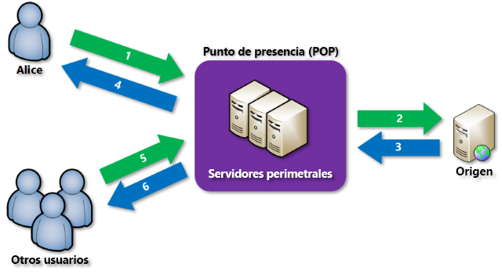

# **Microsoft Certified: Azure Developer Associate - Integración del almacenamiento en caché y entrega de contenido dentro de soluciones**
## **Temario**
- [**Microsoft Certified: Azure Developer Associate - Integración del almacenamiento en caché y entrega de contenido dentro de soluciones**](#microsoft-certified-azure-developer-associate---integración-del-almacenamiento-en-caché-y-entrega-de-contenido-dentro-de-soluciones)
  - [**Temario**](#temario)
  - [**Exploración de Azure Cache for Redis**](#exploración-de-azure-cache-for-redis)
    - [**Niveles de servicio**](#niveles-de-servicio)
    - [**Configuración de Azure Cache for Redis**](#configuración-de-azure-cache-for-redis)
      - [**Adición de un tiempo de expiración a los valores**](#adición-de-un-tiempo-de-expiración-a-los-valores)
  - [**Desarrollo de almacenamiento en CDN**](#desarrollo-de-almacenamiento-en-cdn)
    - [**Exploración de instancias de Azure Content Delivery Network**](#exploración-de-instancias-de-azure-content-delivery-network)
    - [**Requisitos**](#requisitos)
    - [**Limitaciones**](#limitaciones)
    - [**Productos de Azure Content Delivery Network**](#productos-de-azure-content-delivery-network)
    - [**Control del comportamiento de la memoria caché en Azure Content Delivery Network**](#control-del-comportamiento-de-la-memoria-caché-en-azure-content-delivery-network)
      - [**Controlar el comportamiento de almacenamiento en caché**](#controlar-el-comportamiento-de-almacenamiento-en-caché)
      - [**Almacenamiento en caché y período de vida**](#almacenamiento-en-caché-y-período-de-vida)
      - [**Actualizar contenido**](#actualizar-contenido)
      - [**Filtrado geográfico**](#filtrado-geográfico)

## **Exploración de Azure Cache for Redis**
- Almacén de datos en memoria basado en software Redis.
- Ofrece producto de código abierto (OSS Redis) y comercial (Redis Enterprise).
- Patrones de arquitectura de aplicaciones comunes:
  - Caché de datos: Cargar datos de una database grande cuando es necesario.
  - Caché de contenido: Acceso a contenido estático como plantillas,encabezados,fotter,banners.
  - Almacén de sesión: carros de compra, datos de historial de usuario y asociar con cookies de usuario.
  - Almacenamiento en cola de trabajos y mensajes
  - Distributed transactions

### **Niveles de servicio**
- Básico: OSS Redis en 1 VM. No tiene SLA. Ideal para desarrollo y no críticas
- Estándar: OSS Redis en 2 VM. Se replican
- Premium: OSS Redis de alto rendimiento. Menor latencia,disponibilidad y más. Mejor VM que estándar y básico.
- Enterprise: Redis Enterprise. Módulos de Redis, RediSearch,Bloom,TimeSteries y disponibilidad aún mayor que Premium
- Enterprise Flash: Caché de gran tamaño. Nivel aplica el almacenamiento de datos en memoria no volátil, más barata que DRAM. Reduce costo total de memoria por GB.

### **Configuración de Azure Cache for Redis**
#### **Adición de un tiempo de expiración a los valores**
- Tener una forma de que expiren los valores cuando estén obsoletos
- Se aplica un período de vida (TTL) a una clave:
  - Precisión de segundos o milisegundos
  - Resolución de tiempo de expiración siempre es 1 milisegundo
  - Información de las expiraciones se replica y se conserva en disco

## **Desarrollo de almacenamiento en CDN**
### **Exploración de instancias de Azure Content Delivery Network**
Azure Content Delivery Network (CDN) ofrece solución de entrega rápida de contenido con alto ancho de banda a usuarios mediante almacenamiento en caché.
- También acelera contenido dinámico que no se almacena en caché
- Usa optimizaciones de red mediante ubicaciones POP de CDN.
- Ejemplo: Omitir protocolo de puerta de enlace de borde (BGP).

1. Un suario solicita archivo mediante URL como `<endpoint name>.azureedge.net`. Sistema DNS enruta la solicitud hasta ubicación POP con mejor rendimiento.
2. Si los servidores de POP no tienen el archivo en memoría caché. el punto POP solicita el archivo al servidor de origen.
3. El servidor de origen devuelve el archivo a un servidor POP
4. Este servidor POP almacena en caché y devuelve al solicitante original. El archivo permanece hasta que expira el TTL especificado por sus encabezados HTTP. Si no se especifica, valor predeterminado es 7 días.

### **Requisitos**
- Para usar Azure CDN, se debe crear un perfil de CDN: Colección de puntos de conexión de CDN.
- Los precios se aplican en nivel de perfil de CDN.

### **Limitaciones**
- Número de perfiles de CDN por suscripción
- Número de puntos de conexión que pueden crearse en un perfil
- Número de dominios personalizados que pueden asignarse a un punto de conexión

### **Productos de Azure Content Delivery Network**
Incluye cuatro productos:
- Azure CDN Estándar de Microsoft
- Azure CDN Estándar de Akamai
- Azure CDN estándar de Verizon
- Azure CDN premium de Verizon

### **Control del comportamiento de la memoria caché en Azure Content Delivery Network**
- Controlar cuando se actualiza el contenido
- No se compara con la versión en servidor cada que se tiene acceso, en su lugar se considera que en caché está la última versión.
- Se considera que un recurso está actualizado cuando su antiguedad es menor que el tiempo o el período definido por una configuración de caché.

#### **Controlar el comportamiento de almacenamiento en caché**
- Reglas de caché: Globales o personalizadas. Aplican a rutas de acceso y extensiones de archivo
- Almacenamiento en caché de cadena de consulta: Como responde CDN en una cadena de consulta. 

#### **Almacenamiento en caché y período de vida**
Si no establece un período de vida en un archivo, Azure CDN establece un valor predeterminado
- Optimización de entrega web generalizada: siete días
- Optimización de grandes archivos: un día
- Optimización de streaming multimedia: un año
Pero dicho valor se puede reemplazar si ha configurado reglas de almacenamiento en caché en Azure.

#### **Actualizar contenido**
- Para asegurarse que el cliente obtiene la versión del recurso más reciente: implemente una URL del recurso.

#### **Filtrado geográfico**
Autorizar o bloquear contenido en países específicos según el código del país.
