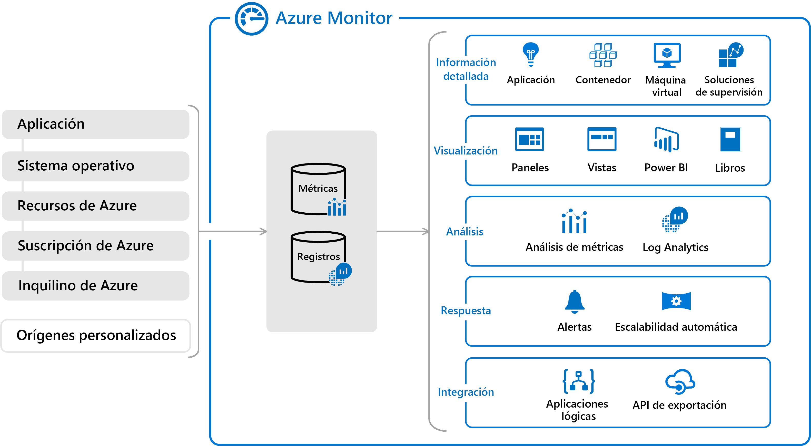

# **Microsoft Certified: Azure Developer Associate - Supervisión del rendimiento de la aplicación**
## **Temario**
- [**Microsoft Certified: Azure Developer Associate - Supervisión del rendimiento de la aplicación**](#microsoft-certified-azure-developer-associate---supervisión-del-rendimiento-de-la-aplicación)
  - [**Temario**](#temario)
  - [**Explorar Azure Monitor**](#explorar-azure-monitor)
    - [**¿Qué datos recopila Azure Monitor?**](#qué-datos-recopila-azure-monitor)
    - [**Supervisión de la plataforma de datos**](#supervisión-de-la-plataforma-de-datos)
    - [**Insight y visualizaciones seleccionadas**](#insight-y-visualizaciones-seleccionadas)
    - [**Exploración de Application Insights**](#exploración-de-application-insights)
    - [**Qué supervisa Application Insights**](#qué-supervisa-application-insights)
    - [**Detección de métricas basadas en registros**](#detección-de-métricas-basadas-en-registros)
    - [**Selección de una prueba de disponibilidad**](#selección-de-una-prueba-de-disponibilidad)
    - [**Solución de problemas de rendimiento de aplicaciones mediante el Mapa de aplicación**](#solución-de-problemas-de-rendimiento-de-aplicaciones-mediante-el-mapa-de-aplicación)

## **Explorar Azure Monitor**
- Recopilar, analizar y ACTUAR en la telemetría desde local o en la nube.
- Rendimiento de aplicaciones e identificar proactivamente problemas

- Almacenes de datos: métricas y registros

### **¿Qué datos recopila Azure Monitor?**
- Datos de supervisión de aplicaciones: del código escrito
- Datos de supervisión del sistema operativo invitado: del S.O. donde se ejecuta la aplicación(Nube o local)
- Datos de supervisión de recursos de Azure
- Datos de supervisión de la suscripción de Azure
- Datos de supervisión del inquilino de Azure

### **Supervisión de la plataforma de datos**
- Se clasifican como: métricas o registros
- Métricas: valores numéricos. Pueden admitir escenarios de tiempo casi real.
- Registros: Contienen datos organizados en registros con diferentes conjuntos de propiedades para cada tipo.
- Se pueden consultar para analizar

### **Insight y visualizaciones seleccionadas**
- Application Insights: Disponibilidad, rendimiento y uso. (Local o en nube). Usa Azure Monitor
- Container Insights: Rendimiento de cargas de trabajo de contenedor. Métricas de controladores, nodos y contenedores. También registros del contenedor.
- VM Insights: Rendimiento y estado de VM Windows y Linux. Identifica procesos y dependencias interconectadas en procesos externos. 

### **Exploración de Application Insights**
- Característica de Azure Monitor.
- Servicio de Application Performance Management (APM) extensible para DevOps.
- Instala un SDK en su aplicación o habilite Application Insights.
- Supervisa aplicación y dirige los datos a un recurso de Azure Application Insight mediante un GUID único

### **Qué supervisa Application Insights**
- Tasas de solicitud, tiempos de respuesta y tasas de error
- Tasas de dependencia, tiempos de respuesta y error
- Excepciones
- Vistas de página y rendimiento de carga
- Llamadas AJAX
- Número de usuarios y sesiones
- Contadores de rendimiento
- Diagnóstico de host
- Registros de seguimiento de diagnóstico
- Métricas y eventos personalizados

### **Detección de métricas basadas en registros**
- Métricas basadas en registros: traducen en consultas de KUSTO.
- Métricas estándar: series temporales

> Crear paneles y alertas en tiempo real, son mejor con métricas estándar.

### **Selección de una prueba de disponibilidad**
- Application Insights envía solicitudes web a la aplicación a intervalos regulares desde puntos de todo el mundo. Puede enviar una alerta si la aplicación no responde o si responde de manera demasiada lenta.
- Ni siquiera es necesario que sea un sitio de su propiedad.

### **Solución de problemas de rendimiento de aplicaciones mediante el Mapa de aplicación**
Mayor información: https://docs.microsoft.com/es-es/training/modules/monitor-app-performance/7-application-map